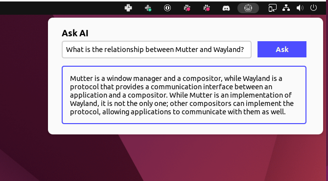

# Ask AI

Get AI-powered explanations instantly in your GNOME Shell.

AskAI uses OpenAI's GPT-3 API to generate responses. Specifically, this extension uses GPT-3 Davinci v3, OpenAI's most powerful model (and the same one behind "ChatGPT"). This GNOME extension is set up with a `CTRL + SHIFT + Y` shortcut to open the AskAI window.

**Current Project State:** `Functioning Early Prototype`



## Prerequisite: OpenAI API Key

AskAI needs an OpenAI API key to work. Anyone can create an OpenAI account and get an API key: [https://openai.com](https://openai.com/).

While new accounts get $20 in credits, OpenAI will eventually start charging for usage. For personal usage GPT-3 should be cheap, usually fractions of a penny per a prompt. More information about pricing here: [https://openai.com/api/pricing/](https://openai.com/api/pricing/).

## Installation

After completing one of the installation methods below, restart GNOME Shell (*Xorg: `Alt`+`F2`, `r`, `Enter` - Wayland: `log out` or `reboot`*) and enable the extension through the *gnome-extensions* app.

## Install From Source

This method installs to your `~/.local/share/gnome-shell/extensions` directory from the latest source code on the `main` branch.

First make sure you have the following dependencies installed:

| Arch Based     | Debian Based                  | Fedora                 |
| ---            | ---                           | ---                    |
| `dconf`        | `dconf-gsettings-backend`     | `dconf`                |
| `gnome-shell`  | `gnome-shell-extension-prefs` | `gnome-extensions-app` |
| `git`          | `git`                         | `git`                  |
| `base-devel`   | `build-essential`             | `glib2-devel`          |
|                | `gettext`                     | `gettext-devel`        |
|                | `libsoup3`                    |                        |

Then run the following commands:

```bash
make && make install
```

## TODO

- [ ] Allow the response to be copied to the clipboard
- [ ] Support different "modes" for different types of usage. (ie summaries, text editing, etc)

## Credits

The maintainers of the GNOME extension, [OpenWeather](https://gitlab.com/skrewball/openweather). I came into this project as a web dev knowing nothing about GNOME development, and their extension was a great starting point to learn from.

Robot icon by [Mariella Steeb](https://openmoji.org/library/#author=Mariella%20Steeb) via OpenEmoji.
