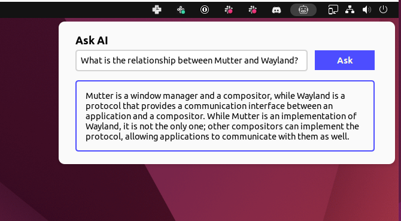

# Ask AI

Get AI-powered explanations instantly in your GNOME Shell.

AskAI uses OpenAI's GPT-3 API to generate responses. Specifically, this extension uses GPT-3 Davinci v3, OpenAI's most powerful model (and the same one behind "ChatGPT"). This GNOME extension is set up with a `CTRL + SHIFT + Y` shortcut to open the AskAI window.

**Current Project State:** `Functioning Early Prototype`



## Prerequisite: OpenAI API Key

AskAI needs an OpenAI API key to work. Anyone can create an OpenAI account and get an API key: [https://openai.com](https://openai.com/).

While new accounts get $20 in credits, OpenAI will eventually start charging for usage. For personal usage GPT-3 should be cheap, usually fractions of a penny per a prompt. More information about pricing here: [https://openai.com/api/pricing/](https://openai.com/api/pricing/).

## Installation

After completing one of the installation methods below, restart GNOME Shell (*X11: `Alt`+`F2`, `r`, `Enter` - Wayland: `log out` or `reboot`*) and enable the extension through the *gnome-extensions* app.

## Install From Source

This method installs to your `~/.local/share/gnome-shell/extensions` directory from the latest source code on the `main` branch.

First make sure you have the following dependencies installed:

| Arch Based     | Debian Based                  | Fedora                 |
| ---            | ---                           | ---                    |
| `dconf`        | `dconf-gsettings-backend`     | `dconf`                |
| `gnome-shell`  | `gnome-shell-extension-prefs` | `gnome-extensions-app` |
| `git`          | `git`                         | `git`                  |
| `base-devel`   | `build-essential`             | `glib2-devel`          |
|                | `gettext`                     | `gettext-devel`        |
|                | `libsoup3`                    |                        |

Then run the following commands:

```bash
make && make install
```

## Usage

1. Once `make install` runs successfully, GNOME Shell needs to be restarted. (*X11: `Alt`+`F2`, `r`, `Enter` - Wayland: `log out` or `reboot`*)
2. Enable the extension through the *gnome-extensions* app.
3. Open the extension preferences via the same *gnome-extensions* app and enter your OpenAI API key.
4. The icon in the top bar can either be clicked or the `CTRL + SHIFT + Y` shortcut can be used to open the AskAI window.
5. After typing a prompt, either "Ask" can be pressed or just hitting `Enter` will send the prompt to GPT-3.

## TODO

- [ ] Allow the response to be copied to the clipboard.
- [ ] Add button to open settings from this extension.
- [ ] Support different "modes" for different types of usage. (ie summaries, text editing, etc)

## Development

Here's the general dev flow:

1. Leave `journalctl -f -o cat /usr/bin/gnome-shell` running in a terminal to see any errors/logs. This command does not need to be restarted when the extension is reloaded.
2. Make changes to the code.
3. Run `make install` - It builds the extension and puts it in `~/.local/share/gnome-shell/extensions` (So do not clone this repo into that directory!).
4. Restart GNOME Shell (*X11: `Alt`+`F2`, `r`, `Enter` - Wayland: `log out` or `reboot`*). Unfortunately, Wayland doesn't seem to have a better way than to log out. (But, locking/unlocking might work - I haven't tested).
5. The extension should now be running if you've previously enabled it. If not, enable it through the *gnome-extensions* app. If you're testing the preferences UI, *gnome-extensions* will need to be re-opened.

## Docs for Development

- [Quick overview of GNOME Shell Extension development](https://gjs.guide/extensions/development/creating.html)
- [Official GNOME Shell Extension API docs](https://gjs-docs.gnome.org/) (Individual libraries from these docs are linked in the "Libraries" section)

### The Linux GUI in a nutshell

**To state how everything fits together** because I had a lot trouble trying to userstand how Linux GUIs work:

- Your Linux system has a [**display server**](https://www.wikiwand.com/en/Display_server), it manages GUI - windows, menus, pointer, etc. It's called a "server" because decades ago *running* an application on one computer and *showing* the GUI on another computer was a common use-case.
- The display server uses a **protocol** to communicate with its clients (ie desktop applications).
  - Your system probably uses either the [**X11**](https://www.wikiwand.com/en/X_Window_System) or [**Wayland**](https://www.wikiwand.com/en/Wayland_compositor) protocol. X11 has been around ~30 years (older than Linux itself!), Wayland is younger at ~15 years.
  - On Ubuntu, opening the "About" app will tell you which you have under "Windowing System". This can be a little confusing because "System" makes it sound like X11 or Wayland runs code. But X11 and Wayland only refer to the "protocol".
- A protocol is just that, a protocol, to actually run the display server, you need an implementation of the protocol. A display server implementation is also called a [**Window Manager**](https://www.wikiwand.com/en/Window_manager).
  - Wayland has a name for a display server that implements the Wayland protocol, a **Wayland Compositor**.
    - One such example of a Wayland Compositor is [**Mutter**](https://gitlab.gnome.org/GNOME/mutter).
  - X11 works slightly different in that the "compositor" is a second, separate program called the "compositing window manager" used *in addition* to the display server implementation.
    - An example of a display server implementation of the X11 protocol is "X.Org Server".
    - As mentioned, this implementation needs a second program to do the compositing.
      - One example is **Mutter**, which acts as an X11 window manager and compositor.
    - A word on naming - X/X11/Xorg can be used interchangeably, but it might be useful to know the nuances - the protocol is called the "X Window System" or "X" for short. X11 is the "current" release of this protocol, released in 1987. X.Org/Xorg is used to refer to the project as a whole.
- There's other window managers, but Mutter is specifically mentioned because [**GNOME Shell**](https://www.wikiwand.com/en/GNOME_Shell) runs on Mutter. And since Mutter works with both X11 and Wayland, GNOME Shell also works on both.
  - Specifically, GNOME Shell is implemented as a plugin in Mutter.
- GNOME Shell is the "shell" of the **GNOME desktop environment**. It was introduced to improve the stock GNOME environment. GNOME Shell being a Mutter plugin does however mean that the GNOME user experience is tighly coupled with Mutter, you can't swap out Mutter for another window manager without breaking GNOME.
- And finally, this project! ..is an extension for the GNOME Shell.... which is a plugin for Mutter.. which is a window manager for X11 and Wayland.. which are display server protocols.

### Libraries

- `Clutter`: is a 2D graphics library that is used by GNOME Shell to draw the UI. [Official Clutter Docs](https://gnome.pages.gitlab.gnome.org/mutter/clutter/)
  - Note that while GNOME Shell extension development can keep using Clutter without issue, [Clutter is no longer part of the GNOME SDK](https://blogs.gnome.org/clutter/2022/02/16/retiring-clutter/).
- `Gio`: is a library for input/output and networking. It is used by GNOME Shell to read and write files, and to communicate with the network. [Offical Gio docs](https://gjs-docs.gnome.org/gio20~2.0/)
- `Gtk`: is a library for creating graphical user interfaces. [Official Gtk docs](https://gjs-docs.gnome.org/gtk30~3.0/)
- `GLib`: is a library for common tasks such as data structures, file manipulation, and string manipulation. [Official GLib docs](https://gjs-docs.gnome.org/glib20~2.0/)
- `GObject`: is a library for object-oriented programming. [Official GObject docs](https://gjs-docs.gnome.org/gobject20~2.0/)
- `Meta`: is a library for the window manager. [Official Meta docs](https://gjs-docs.gnome.org/meta11~11/)
- `Pango`: is a library for text layout and rendering. [Official Pango docs](https://gjs-docs.gnome.org/pango10~1.0/)
- `Shell`: is a library for the GNOME Shell. [Official Shell docs](https://gjs-docs.gnome.org/shell01~0.1/)
- `St`: is a library for creating graphical user interfaces. [Official St docs](https://gjs-docs.gnome.org/st10/)
- `libsoup3`: is a library for HTTP requests. [Official libsoup3 docs](https://gjs-docs.gnome.org/libsoup3~3.0/)

## Credits

The maintainers of the GNOME extension, [OpenWeather](https://gitlab.com/skrewball/openweather). I came into this project as a web dev knowing nothing about GNOME development, and their extension was a great starting point to learn from.

Robot icon by [Mariella Steeb](https://openmoji.org/library/#author=Mariella%20Steeb) via OpenEmoji.
